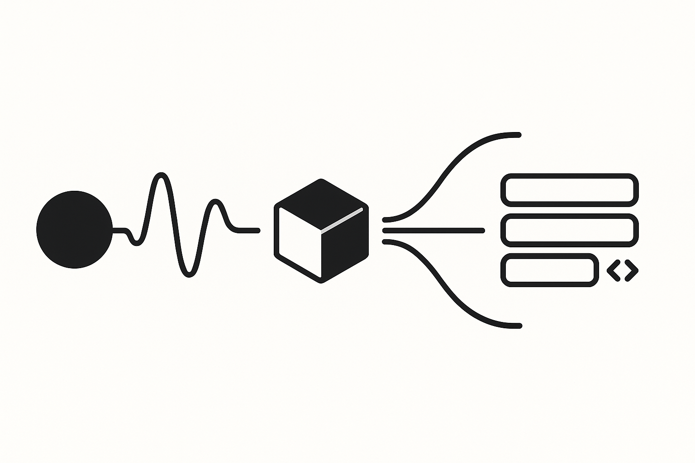

<p align="center">
  
</p>

<h1 align="center">Glyph</h1>
<p align="center"><em>Voice-controlled markdown editing that doesn't suck</em></p>

**Voice is an underutilized interface. Most tools treat it as a gimmick, but voice can drive complex workflows faster than typing when done right.**

**Glyph is a voice-native, agentic markdown editor with conversational AI that learns your patterns and maintains context across sessions.**

[](https://www.python.org/downloads/)
[](https://opensource.org/licenses/MIT)
[](https://openai.com/)
[](https://github.com/openai/whisper)

---

## Documentation

- **[Installation Guide](INSTALLATION.md)** - Setup and configuration
- **[Complete Functionality](FUNCTIONALITY.md)** - Feature overview and usage examples
- **[Architecture Documentation](ARCHITECTURE.md)** - Technical design and implementation
- **[Testing Guide](TESTING_GUIDE.md)** - QA documentation and test coverage
- **[Contributing Guidelines](CONTRIBUTING.md)** - Development setup and contribution process

---

## What this does

Glyph has two modes:

1. **Direct editing**: Point it at a markdown file, say what you want changed, see a diff, approve or reject
2. **Agent mode**: Conversational AI that manages your entire Obsidian vault, remembers context across sessions

The agent mode is where it gets interesting - it learns how you refer to your notes and can handle complex multi-step operations through natural conversation.

---

## Why I built this

Most tools treat voice as an afterthought - a novelty feature that barely works. But voice is actually faster than typing for many operations, especially when you're already thinking in natural language.

Voice commands like "mark the third task complete" or "link this to my architecture notes" are faster than clicking through menus, but most voice tools can't handle context or remember how you work.

Voice works everywhere - on mobile where typing sucks, when your hands are busy, or when you're thinking through complex problems and don't want to stop to navigate UIs. The key is building voice interfaces that actually understand what you mean and remember what you've done, not just transcribe words. Glyph achieves this through persistent memory, multi-turn conversations, context tracking, and a learning system that improves with usage.

---

## Quick start

```bash
git clone https://github.com/tnagar72/Glyph.git
cd Glyph
python -m venv glyph_env && source glyph_env/bin/activate
pip install -r requirements.txt

# Test it works
python main.py --transcript-only

# Try agent mode (the fun part)
python main.py --setup-agent  # point it at your Obsidian vault
python main.py --agent-mode
```

Then just talk to it:
```
You: "Create a note about today's standup"
Glyph: ✅ Created "Daily Standup 2024-07-08.md"

You: "Add action items section to it" 
Glyph: ✅ Added section "Action Items" to Daily Standup 2024-07-08.md

You: "Open that note in Obsidian"
Glyph: ✅ Opened Daily Standup 2024-07-08.md in Obsidian
```

---

## Direct editing mode

For when you just want to edit a single file:

```bash
# Edit a specific file
python main.py --file notes.md

# Preview changes without applying (recommended first time)
python main.py --file notes.md --dry-run

# Use Enter-to-stop recording if spacebar interferes with your terminal
python main.py --file notes.md --enter-stop
```

Voice command examples:
- *"Mark the second task as complete"*
- *"Add a new task about fixing the deployment pipeline"*
- *"Move the meeting notes section to the top"*
- *"Change the deadline from Friday to next Monday"*

---

## Agent mode (the interesting part)

This is where Glyph shines. It's a conversational AI that:

- **Remembers context** across the entire session
- **Learns your note names** and handles typos/variations
- **Manages your whole vault** with 15+ specialized tools
- **Handles multi-step operations** through natural conversation

```bash
# Set up once
python main.py --setup-agent

# Launch agent
python main.py --agent-mode

# Text-only mode for testing without voice
python main.py --agent-mode --text-only
```

### What the agent can do

**File operations:**
- Create, read, edit, delete, rename, move notes
- Add/edit sections within notes
- Generate summaries and content
- Create links between notes

**Smart features:**
- Learns how you refer to notes ("my stanford app" → "Stanford Application.md")
- Handles typos and partial matches
- Maintains conversation context ("add that to the note I just created")
- Automatically backs up before making changes

**Example conversation:**
```
You: "Find my notes about the API redesign"
Agent: Found: "API Redesign Proposal.md", "API Migration Notes.md"

You: "Open the proposal one"
Agent: ✅ Opened "API Redesign Proposal.md" in Obsidian

You: "Add a section about backwards compatibility"
Agent: ✅ Added section "Backwards Compatibility" to API Redesign Proposal.md

You: "Link it to my migration notes"
Agent: ✅ Added wikilink to API Migration Notes.md
```

---

## Live transcription

Real-time voice-to-text streaming:

```bash
# Stream to terminal
python main.py --live

# Copy directly to clipboard
python main.py --live --clipboard

# Pipe to other tools
python main.py --live | grep -i "important" | tee important_notes.txt
```

Great for meeting notes, brainstorming, or any time you need fast voice-to-text.

---

## Configuration

Glyph supports both local Whisper models and OpenAI API transcription:

### Transcription methods
```bash
# Configure your preferred method
python main.py --setup-transcription
```

| Method | Cost | Privacy | Speed | Accuracy |
|--------|------|---------|-------|----------|
| Local Whisper | Free | Complete | 2-10s | Good |
| OpenAI API | $0.006/min | Data sent to OpenAI | 1-3s | Excellent |

### Whisper models
```bash
# Choose model size vs speed tradeoff
python main.py --setup-model
```

| Model | Size | Speed | Use case |
|-------|------|-------|----------|
| tiny | 39MB | Fastest | Quick testing |
| base | 74MB | Fast | Simple commands |
| small | 244MB | Medium | Balanced |
| **medium** | 769MB | Slow | **Recommended** |
| large | 1550MB | Slowest | Best accuracy |

### Audio setup
```bash
# Interactive device selection
python main.py --setup-audio

# View all current settings
python main.py --show-config
```

---

## Technical details

### Architecture

Two main modes with different strengths:

**Direct mode**: `Voice → Whisper → GPT-4 → Diff → Apply`
- Single-shot editing with immediate results
- Rich diff display with user approval
- Automatic backups and undo support

**Agent mode**: `Voice → Context Analysis → Tool Selection → Execution → Learning`
- Persistent conversation state and memory
- Multi-step operations with reference tracking
- Learning system that improves over time

### Key components

```
glyph/
├── main.py                 # Entry point and mode routing
├── recording.py            # Audio capture with validation
├── transcription.py        # Dual transcription service
├── llm.py                 # GPT-4 integration
├── agent_cli.py           # Conversational interface
├── agent_tools.py         # 15+ vault management tools
├── agent_memory.py        # Reference learning system
├── agent_context.py       # Multi-turn conversation tracking
├── interactive_cli.py     # Rich terminal interface
├── live_transcription.py  # Real-time streaming
├── backup_manager.py      # Centralized backup system
└── [config files...]      # Audio, model, transcription setup
```

### Testing

Comprehensive test suite with 100% feature coverage:

```bash
# Quick validation
python run_tests_simple.py

# Full test suite (agent + direct mode)
python run_all_tests.py

# Individual components
python test_agent_comprehensive.py
python test_nonagent_comprehensive.py
```

The tests mock external APIs and audio input, so they run reliably in CI/CD.

---

## Troubleshooting

**Audio not working:**
```bash
# Check devices
python -c "import sounddevice as sd; print(sd.query_devices())"

# Run audio setup
python main.py --setup-audio
```

**Transcription errors:**
```bash
# Test all methods
python main.py --test-transcription

# Use larger model for better accuracy
python main.py --setup-model
```

**Terminal interference (iTerm users):**
```bash
# Use enter-to-stop instead of spacebar
python main.py --agent-mode --enter-stop
```

**Import errors:**
```bash
# Make sure you're in the virtual environment
source glyph_env/bin/activate
```

---

## Requirements

- Python 3.8+ (3.9+ recommended)
- 2GB+ RAM (4GB+ for large Whisper models)
- Microphone
- OpenAI API key (optional, for API transcription)
- Obsidian (optional, for vault integration)

Works on macOS, Linux, and Windows. Tested primarily on macOS with iTerm2.

---

## What's next

Some ideas I'm considering:

- **Plugin architecture**: Let people write custom agent tools
- **Voice synthesis**: Have the agent talk back with confirmations
- **Better context**: Understand relationships between notes
- **Web interface**: For remote access and mobile use
- **Custom models**: Train on your specific note patterns

Open to contributions and ideas. This started as a weekend project but has grown into something I use daily.

---

## Files worth looking at

- `agent_tools.py` - The 15+ tools that power agent mode
- `agent_memory.py` - How the learning system works
- `transcription.py` - Dual transcription with fallback logic
- `test_agent_comprehensive.py` - Comprehensive agent testing
- `TESTING_GUIDE.md` - Complete testing documentation

---

## Contributing

Standard stuff:
- Fork, branch, PR
- Run tests before submitting: `python run_all_tests.py`
- Follow existing code style
- Add tests for new features

The codebase is pretty clean and well-documented. Most complexity is in the agent system and conversation management.

---

## License

MIT - do whatever you want with it.

If you build something cool on top of this, let me know. Always interested to see how people extend it.

---

**Note**: This tool processes voice locally by default but can use OpenAI's API for transcription and text processing. See the privacy/security section in [FUNCTIONALITY.md](FUNCTIONALITY.md) for details.